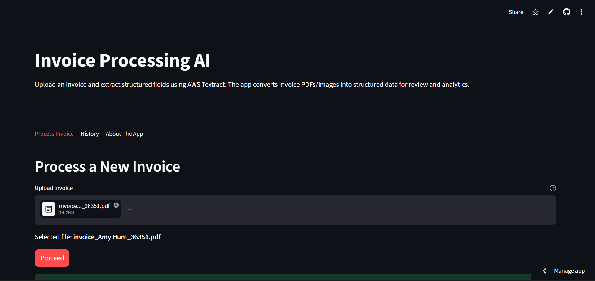
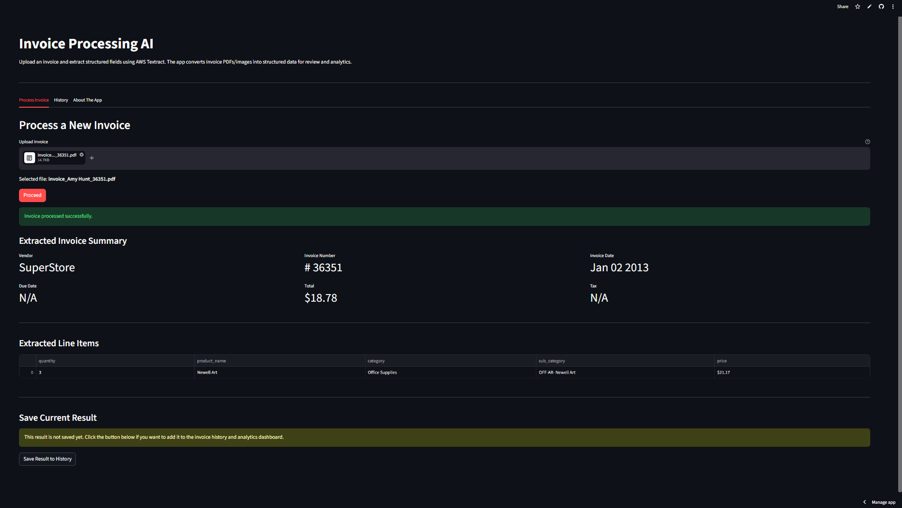

### Upload Interface


### Processed Document


# Invoice Processing AI

A cloud-based Document AI application that extracts structured data from invoice PDFs and images using AWS Textract and presents the results through an interactive Streamlit dashboard.

---

## Live Demo

🔗 https://invoice-doc-ai-4mhqtz22wbqunfojgjdg4h.streamlit.app/

---

## 📌 Project Overview

Manual invoice processing is repetitive, time-consuming, and prone to human error.

This project automates invoice extraction by allowing users to upload PDF or image invoices and automatically extracting:

- Vendor Name
- Invoice Number
- Invoice Date
- Due Date
- Total Amount
- Tax Amount
- Line Items

The extracted data is cleaned, structured, and displayed in a user-friendly dashboard.

---

##Features

- Upload invoices in PDF, PNG, JPG, and JPEG formats
- Extract structured invoice fields using AWS Textract (`AnalyzeExpense`)
- Parse and clean noisy OCR outputs
- Display summary fields and line items
- Save extracted results
- View invoice analytics and history
- Download invoice history as CSV
- Deploy publicly using Streamlit Cloud

---

##Architecture

```text
Invoice PDF/Image
        ↓
Streamlit Upload Interface
        ↓
AWS Textract AnalyzeExpense API
        ↓
Python Parsing & Cleaning Logic
        ↓
Structured Invoice Data
        ↓
Analytics Dashboard